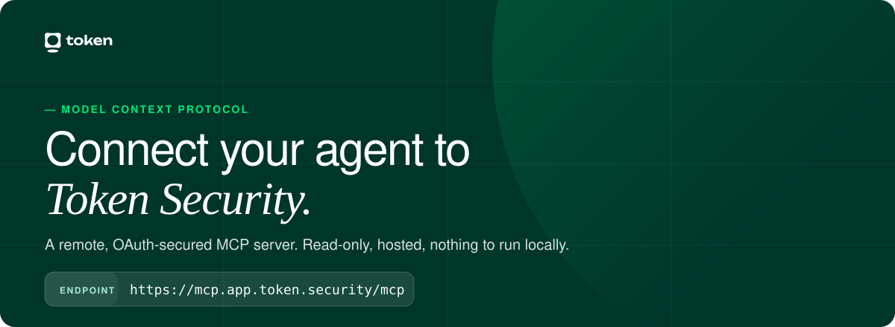

<a href="https://mcp.app.token.security/"></a>

<p align="center"><sub>For existing Token Security customers. The first connection opens a browser to sign in. OAuth, no API key.</sub></p>

## Install

Point any MCP client at `https://mcp.app.token.security/mcp`. One-click buttons for Cursor, VS Code and Claude Code are on the [install page](https://mcp.app.token.security/).

### Cursor

1. Open **Cursor Settings → Plugins**.
2. Search for **Token Security**.
3. Click **Install**, then sign in when the browser opens.

Or run `/add-plugin token-security` in chat.

Without the plugin, add the server to `~/.cursor/mcp.json` and sign in from **Customize → MCPs → token-security → Authenticate**:

```json
{
  "mcpServers": {
    "token-security": { "type": "http", "url": "https://mcp.app.token.security/mcp" }
  }
}
```

### Claude Code

```bash
claude mcp add --transport http token-security https://mcp.app.token.security/mcp
```

Then run `/mcp` inside Claude Code to sign in.

### Claude.ai and Claude Desktop

Settings → **Connectors** → Add custom connector. Name it `Token Security`, URL `https://mcp.app.token.security/mcp`. Start a chat and sign in when Claude asks. Needs a paid Claude plan.

### VS Code, Codex and other clients

```bash
codex mcp add token-security --url https://mcp.app.token.security/mcp
```

A client with no remote-server support can bridge with `npx mcp-remote https://mcp.app.token.security/mcp`.

## What you get

**The `token-security` MCP server.** Read-only tools over identities, people, AI agents, secrets, findings, the entity graph, compliance and dashboard metrics. It exposes three meta-tools (`search`, `get_schema`, `execute`) that find and run the underlying tools, so the agent loads only what a question needs.

**Four skills** that turn the tools into workflows:

| Skill | Ask it |
|---|---|
| `triage-finding` | "Why is this flagged, and what closes it?" |
| `identity-blast-radius` | "What can `deploy-bot` reach, and who owns it?" |
| `ai-agent-inventory` | "Which AI agents run in our environment, and what do they touch?" |
| `secrets-exposure` | "Do we have keys exposed in code, and what do they unlock?" |

## Try it

- "How many open findings do we have, and what are the top 3 types?"
- "Which findings are open on my AWS account, highest severity first?"
- "List the AI agents Token Security has seen in the last 30 days."
- "Show secrets found in code that belong to inactive identities."

<p align="center">
  <sub>
    <a href="https://mcp.app.token.security/">Install page</a> &nbsp;/&nbsp;
    <a href="https://app.token.security">Dashboard</a> &nbsp;/&nbsp;
    <a href="https://modelcontextprotocol.io">What is MCP?</a> &nbsp;/&nbsp;
    <a href="mailto:support@token.security">support@token.security</a>
  </sub>
</p>
